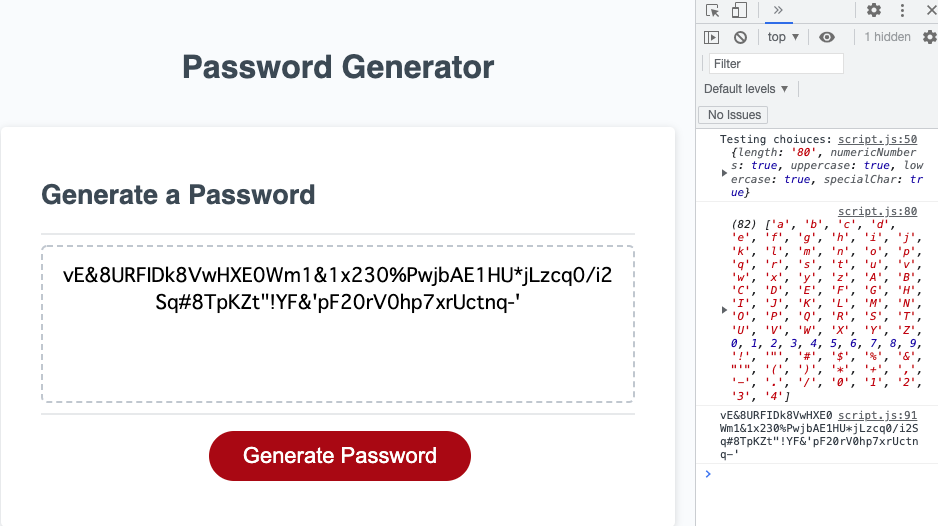

# Password Generator
This is a simple password generator. I did the following points;
1. Ask several questions by window alert
###1-1. Number of characters
1-2. Numeric numbers
1-3. Uppercase
1-4. Lowercase
1-5. Special characters
2. Used specialChar to make the lists of characters
3. Used Math.floor and Math.random to make ramdam passwords
4. Passwords will be displayed on the website

## Screenshot of Deployed site

## Deployed link
[Deployed Site] (https://fumixer.github.io/3-Password-Generator/)
